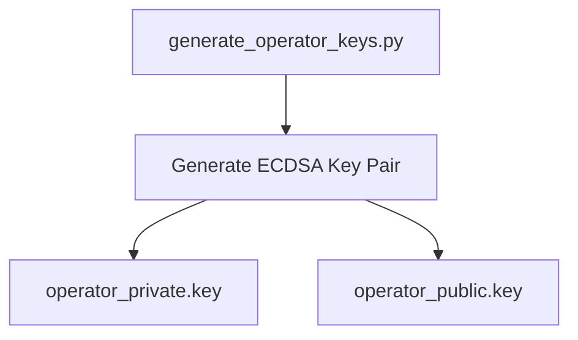
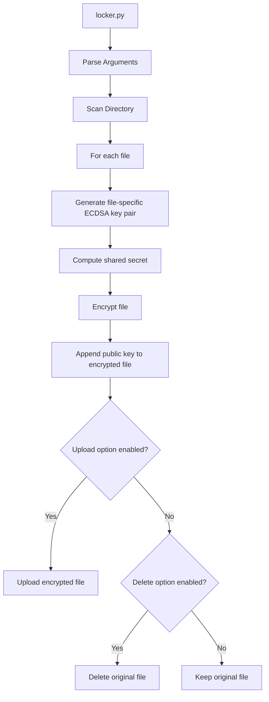
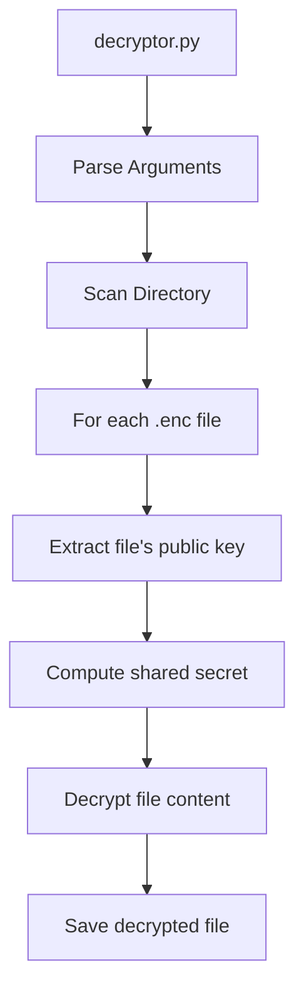
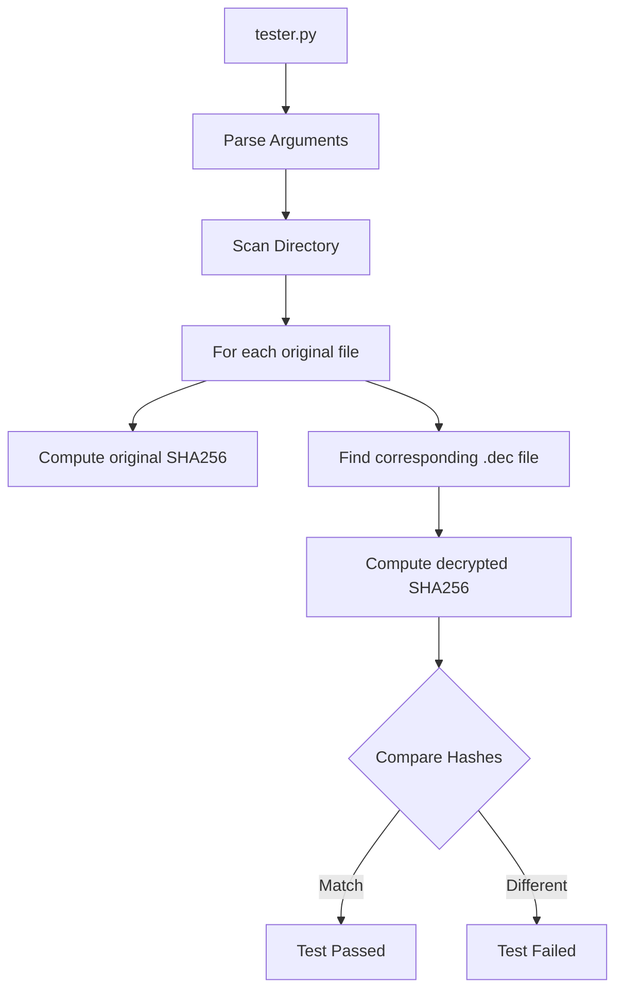

# File Encryption Tool Architecture

## Overview
This tool provides a secure file encryption system using ECDSA (Elliptic Curve Digital Signature Algorithm) for key generation and shared secret computation. The system is designed for research purposes and implements a unique approach where each file gets its own encryption key pair.

## Components

### 1. Operator Key Generation
The system uses a master operator key pair for coordinating encryption/decryption:
- Generates ECDSA key pair for the operator
- Stores private and public keys separately
- Keys used for computing shared secrets with individual file keys

### 2. File Encryption Process
For each file being encrypted:
- Generates unique ECDSA key pair
- Computes shared secret using file's private key and operator's public key
- Encrypts file content using the shared secret
- Appends file's public key to encrypted file
- Optionally uploads or deletes original file

### 3. File Decryption Process
For each encrypted file:
- Extracts the file's public key from the encrypted file
- Computes shared secret using operator's private key and file's public key
- Decrypts file content using the shared secret
- Saves decrypted file with .dec extension

### 4. Integrity Testing
Verifies the encryption/decryption process:
- Computes SHA256 hash of original file
- Computes SHA256 hash of decrypted file
- Compares hashes to ensure data integrity

## Security Considerations

1. **Key Management**
   - Each file gets a unique key pair
   - Private keys are discarded after encryption
   - Only public keys are stored with encrypted files

2. **Shared Secret Computation**
   - Uses ECDSA for secure key exchange
   - Different shared secret for each file
   - Operator's private key required for decryption

3. **File Security**
   - Optional secure deletion of original files
   - Encrypted files contain only ciphertext and public key
   - No metadata or file information leaked

## Implementation Notes

1. **Command Line Interface**
   - All components use argparse for consistent CLI
   - Clear error handling and usage instructions
   - Optional flags for upload/delete operations

2. **File Handling**
   - Supports directory-wide operations
   - Handles various file types and sizes
   - Preserves file structure in encrypted form

3. **Testing**
   - Integrity verification through SHA256
   - Automated testing of encryption/decryption
   - Verification of file content preservation