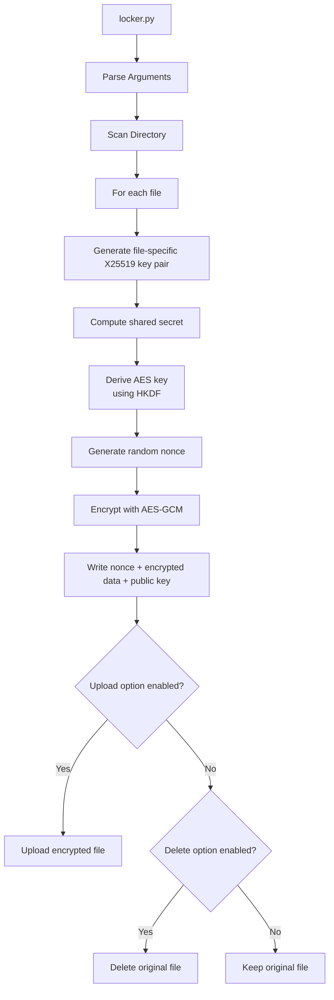
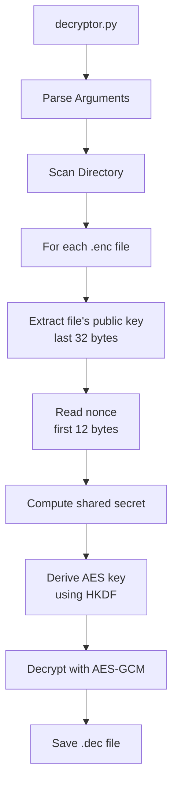
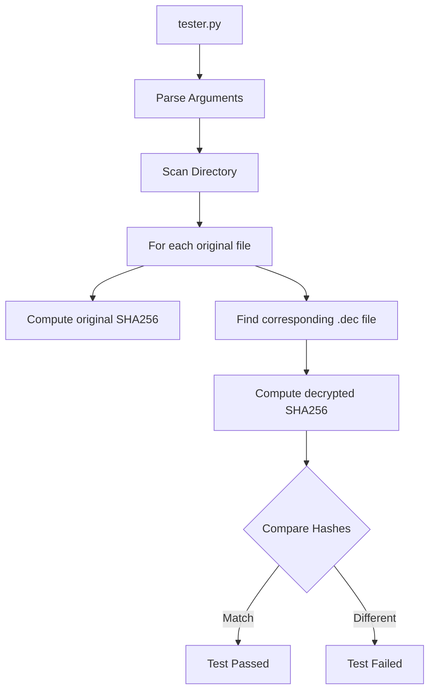

# File Encryption Tool Architecture

## Overview
This tool provides a secure file encryption system using X25519 (Curve25519) for key exchange and AES-256-GCM for authenticated encryption. The system is designed for research purposes and implements a unique approach where each file gets its own encryption key pair.

## Components

### 1. Operator Key Generation
The system uses a master operator key pair for coordinating encryption/decryption:
- Generates X25519 key pair for the operator
- Stores private and public keys as raw bytes
- Keys used for computing shared secrets with individual file keys

```mermaid
graph TD
    A[generate_operator_keys.py] --> B[Generate X25519 Key Pair]
    B --> C[operator_private.key<br/>(32 bytes)]
    B --> D[operator_public.key<br/>(32 bytes)]
```

### 2. File Encryption Process
For each file being encrypted:
- Generates unique X25519 key pair
- Computes shared secret using file's private key and operator's public key
- Encrypts file content using AES-256-GCM
- Prepends random nonce and appends file's public key
- Optionally uploads or deletes original file



### 3. File Decryption Process
For each encrypted file:
- Extracts the file's public key (last 32 bytes)
- Reads nonce (first 12 bytes)
- Computes shared secret using operator's private key and file's public key
- Decrypts file content using AES-256-GCM
- Saves decrypted file with .dec extension



### 4. Integrity Testing
Verifies the encryption/decryption process:
- Computes SHA256 hash of original file
- Computes SHA256 hash of decrypted file
- Compares hashes to ensure data integrity



## Security Considerations

1. **Key Management**
   - Each file gets a unique X25519 key pair
   - File private keys are used only for encryption and immediately discarded
   - 32-byte public keys are stored with encrypted files
   - Operator keys are stored as raw bytes for efficiency

2. **Encryption**
   - AES-256-GCM for authenticated encryption
   - Unique random 12-byte nonce per file
   - HKDF for secure key derivation from shared secrets
   - Built-in authentication and integrity checks

3. **File Security**
   - Optional secure deletion of original files
   - Raw binary format without base64 encoding
   - No metadata or file information leaked
   - Encrypted file size = 12 + original_size + 32 bytes

## Implementation Notes

1. **Command Line Interface**
   - All components use argparse for consistent CLI
   - Clear error handling and usage instructions
   - Optional flags for upload/delete operations

2. **File Format**
   Format: [nonce][encrypted_content][public_key]
   - [nonce]: 12 bytes
   - [encrypted_content]: variable length
   - [public_key]: 32 bytes
   Total overhead: 44 bytes per file

3. **Testing**
   - Integrity verification through SHA256
   - Automated testing of encryption/decryption
   - Verification of file content preservation